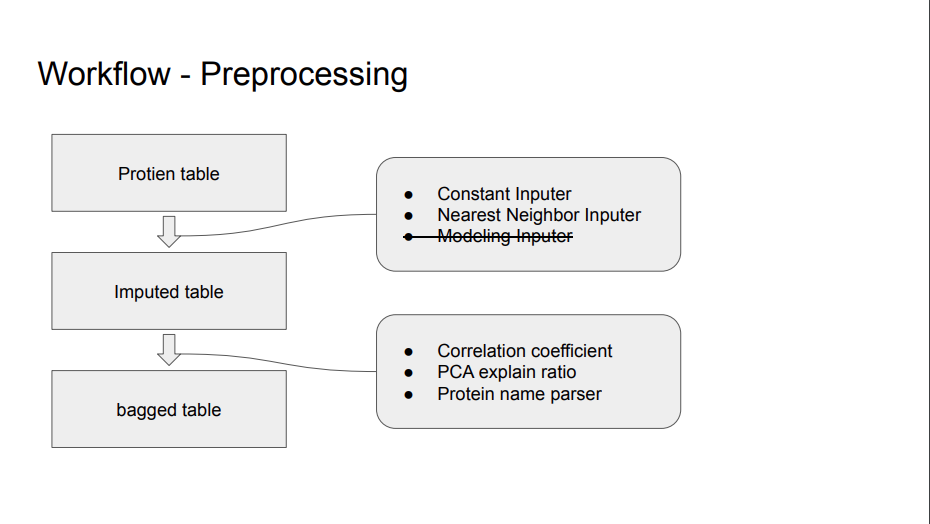
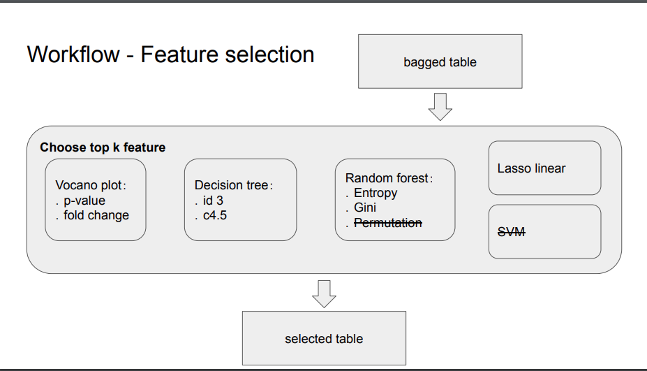
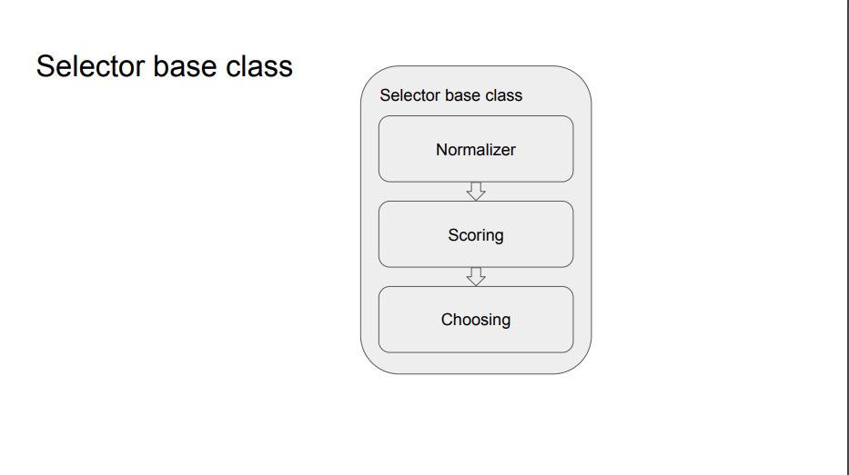

# Auto_selection
bio data auto selection

．Install
open the powershell and move to ./home folder
(1) pipenv (recommended):
    (a) upgrade pip through
        "pip install --upgrade pip"
    (b) install pipenv
        "pip install pipenv"
    (c) install dependency
        "pipenv install -r ./home/requirements.txt"
    (d) activate virtual environment
        "pipenv shell"
    (e) activate jupyter
        "jupyter notebook"
    (f) run the script "./home/example/package_test.ipynb

(2) pip
    (a) upgrade pip through
        "pip install --upgrade pip"
    (b) install dependency
        "pip install -r ./home/requirements.txt"
    (c) activate jupyter
        "jupyter notebook"
    (d) run the script "./home/example/package_test.ipynb"

．Usage
1. workflow

    a. preprocessing
        ．impute
        ．bagging
    b. slection
    
        ．volvano
        ．lasso
        ．random forest
        ．decision tree
        ．SVM