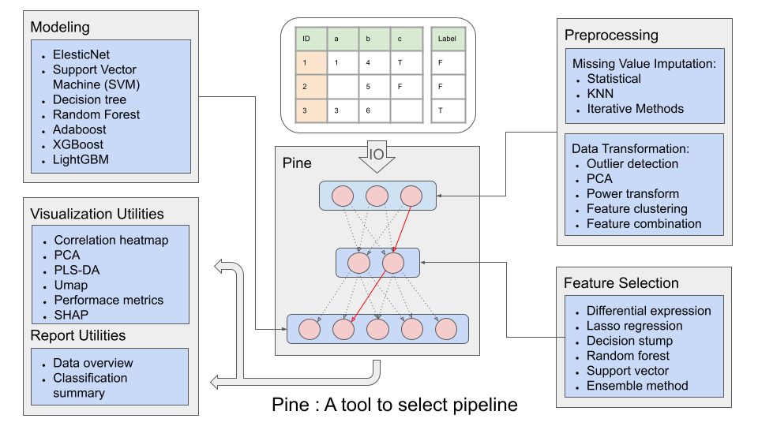

# Overview
In today’s data-driven world, making informed decisions requires more than just raw data—it demands intelligent insights. PineBioML is designed to provide a comprehensive workflow that guides users through every step of data analysis, from preprocessing to visualization. Whether you are a data scientist, researcher, or biomedical data analyst, this software tool empowers you with state-of-the-art machine learning algorithms, advanced feature selection techniques, and dynamic data visualization tools to extract valuable insights effortlessly.

 

 

# Website
To make PineBioML effortless to use, we’ve built an intuitive, seamless, and powerful web platform. Whether you’re a new researcher or a professional analyst seeking high efficiency, you can complete even the most complex analyses with just a few simple steps. Clear interface design, intelligent workflow guidance, and interactive visualizations help you uncover answers faster, spot trends sooner, and make decisions with confidence.
> http://pinebioml.icmol.ncu.edu.tw/

 

# Downloadable package
To give users even more flexibility, PineBioML is also available as a Python package that you can easily download and use within your own working environment. In today’s data-driven era, PineBioML empowers you not only to access data but to uncover deep, meaningful insights with ease. From preprocessing and feature selection to dynamic visualization, you can rely on advanced machine learning algorithms and an intuitive analysis workflow to extract truly valuable information effortlessly.

### System requirements
Compatible with Python 3.9, 3.10, and 3.11.

### Installation
PineBioML is available on PyPI. You can access it through:
> pip install PineBioML

For those who do not know how to use python, you can follow our step by step Installation tutorials.
 - [Windows10/11](./documents/Installization/win11/win11.md)
 - [MacOs](./documents/Installization/macos/macos.md)

# Examples
After installation, you can download examples from release.

> https://github.com/ICMOL/PineBioML/releases/download/example/examples130.zip

Chosse one of the following examples, double click it in jupyter interface:    
| ID |     Name      |       Description                |
|----|---------------|----------------------------------|
|  1 | example_BasicUsage multi class.ipynb   | Demonstrate the basic features of PineBioML on a multi-class classification task.  |  |
|  2 | example_BasicUsage regression.ipynb   | Demonstrate the basic features of PineBioML on a regression classification task.  |  |
|  3 | example_Proteomics.ipynb         | An example on proteomics data analysis. |  |
|  4 | example_PipeLine.ipynb           | Demonstrate how to use the pipeline to store the whole data processing flow. |  |
|  5 | example_Pine.ipynb               | Demonstrate how to use Pine ml to finding the best data processing flow in an efficient way. |  |

### Execute the scripts
Click the buttom and the script should start.

 

# Features
In addition to the convenient Python package download, we also provide comprehensive API documentation to help users quickly get started and fully leverage every feature of PineBioML. Whether you are a data scientist, researcher, or biomedical data analyst, our package and documentation allow you to effortlessly perform the entire workflow—from preprocessing and feature selection to dynamic visualization—and uncover the most valuable insights. 
> [API](https://htmlpreview.github.io/?https://github.com/ICMOL/PineBioML/blob/main/documents/API/index.html)

### 1. Missing value preprocess
|        ID         |        Option         |  Definition |
|---------------------|----------------|------------------------------|
|  1 | Deletion              | Remove the features that are too empty.     |
|  2 | Imputation with a constant value  | Impute missing values with a constant value, such as 0 or the feature mean. |
|  3 | Imputation using K-NN algorithm        | Impute missing values with the mean or median of the k nearest samples. |
|  4 | Imputation by iterative regression  | Impute missing values by random forest regressor interatively. |

### 2. Data transformation
|        ID         |        Option         |  Definition |
|---------------------|----------------|------------------------------|
|  1 | PCA              | Principal component transform.    |  |
|  2 | Power transform  | To make data more Gaussian-like, you can use either Box-Cox transform or Yeo-Johnson transform. |   |
|  3 | Feature clustering        | Group similar features into a cluster.  |  |
|  4 | Feature expansion        | Generating new features by add/product/ratio in random pair of existing features.  |  |

### 3. Feature selection
|        ID         |        Option         |  Definition |
|---------------------|----------------|------------------------------|
|  1 | Volcano plot     | Selecting by group p-value and fold change.   |  |
|  2 | Lasso regression | Selecting by Linear models with L1 penalty. |   |
|  3 | Decision stump   | Selecting by 1-layer decision tree.  |  |
|  4 | Random Forest    | Selecting by Gini impurity or permutation importance over a Random Forest. |  |
|  5 | AdaBoost         | Selecting by Gini impurity over a AdaBoost model.  |  |
|  6 | Gradient boosting| Selecting by Gini impurity over a gradient boosting, such as XGboost or LightGBM.  |  |
|  7 | Linear SVM              | Selecting by support vector from support vector machine. |  |

### 4. Model building
The following models are available in PineBioML’s hyperparameter tuner:
|        ID         |        Model         |  Definition |
|---------------------|----------------|------------------------------|
|  1 | ElasticNet    | Tuner will search the power and the ratio between L1 and L2 regularization on a logistic regression.   |  |
|  2 | SVM       | Tuner will search the proper svm kernel function from one of linear, polynomial, rbf and sigmoid, and also the power of regulization. |   |
|  3 | Decision Tree | The tuner will search through several decision-tree splitting constraints. Including tree depth, leaf size and leaf pruning threshold. |  |
|  4 | Random Forest | Beyond standard decision-tree hyperparameters, the tuner also explores the subsampling proportion for bootstrap sampling and the number of trees in the forest. |  |  |
|  5 | AdaBoost | Tuner will tune the step size and the number of boosting steps.  |  |
|  6 | XGBoost | In addtion to the tree hyperparameters, the tuner will search on gradient boosting steps, step size, L1 & L2 penalty and subsampling ratio.  |  |
|  7 | LightGBM | Similar to XGBoost.  |  |
|  8 | CatBoost | Similar to XGBoost.  |  |

PineBioML’s tuner not only optimizes model hyperparameters, but also handles class imbalance (through sample weighting), provides a unified model API and prediction formatting, and manages the definition of the hyperparameter search space.

### 5. Report and visualization
|        ID         |        Option         |  Definition |
|---------------------|----------------|------------------------------|
|  1 | data_overview  | Giving a glance to input data.   |  |
|  2 | classification_summary | Summarizing a classification task. |  |

 

# Data for Test
The test data is downloaded from [LinkedOmicsKB](https://kb.linkedomics.org/)
>  **A proteogenomics data-driven knowledge base of human cancer**, Yuxing Liao, Sara R. Savage, Yongchao Dou, Zhiao Shi, Xinpei Yi, Wen Jiang, Jonathan T. Lei, Bing Zhang, Cell Systems, 2023.

 

# Questions
If you encounter any issues or have any questions while using this software or website, you are welcome to ask or discuss them in GitHub Issues. We will do our best to provide assistance and answers there.

