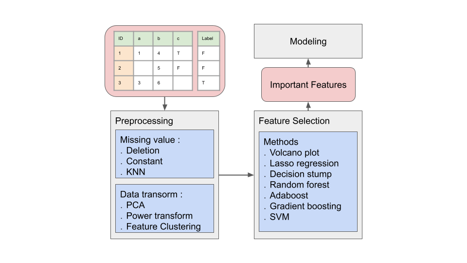
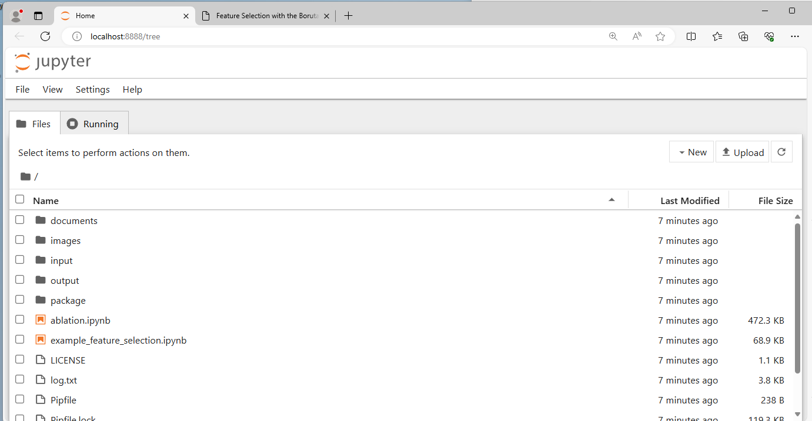

# Overview
This package aims to help analysis biomedical data using ML method in python. 

 

# System requirements
   1. Python 3.9+
   2. The following dependencies are required: numpy, pandas, scikit-learn, matplotlib, seaborn, tqdm, jupyter, lightgbm, xgboost

# Installation

### 1. Install Python
Please follow the tutorial to install python (the "Visual Studio Code" and "Git" are optional):

    https://learn.microsoft.com/en-us/windows/python/beginners 
    
Please skip this step, if you have python 3.9+ installed in your PC.

### 2. Install dependencies and execute the scripts

Step 1. Download our scripts from Release and unzip it.

    https://github.com/ICMOL/undetermined/releases

Step 2. Install dependencies: Please open Windows PowerShell, move to the directory of our scripts, and execute the following command.

    > pip install -r ./requirements.txt          

Step 3. Open the jupyter interface

Please execute the following command to open jupyter. You will see the figure, if the scripts execute correctly.

    > jupyter notebook    

# Input Table Format

The input data should be tabular and placed in the ./input folder. We accept .csv, .tsv, .xlsx and R-table in .txt formats.

# Process

[API](https://htmlpreview.github.io/?https://github.com/ICMOL/PineBioML/blob/main/documents/API/index.html)

### 1. Missing value preprocess
|        ID         |        Option         |  Definition |
|---------------------|----------------|------------------------------|
|  1 | Deletion              | Remove the features that are too empty.     |
|  2 | Imputation with a constant value  | Impute missing values with a constant value, such as 0 or the feature mean. |
|  3 | Imputation using K-NN algorithm        | Impute missing values with the mean or median of the k nearest samples. |

### 2. Data transformation
|        ID         |        Option         |  Definition |
|---------------------|----------------|------------------------------|
|  1 | PCA              | Principal component transform.    |  |
|  2 | Power transform  | To make data more Gaussian-like, you can use either Box-Cox transform or Yeo-Johnson transform. |   |
|  3 | Feature clustering        | Group similar features into a cluster.  |  |

### 3. Feature Selection
|        ID         |        Option         |  Definition |
|---------------------|----------------|------------------------------|
|  1 | Volcano plot  | Seleting by group p-value and fold change   |  |
|  2 | Lasso regression | Seleting by Linear models with L1 penalty |   |
|  3 | Decision stump        | Seleting by 1-layer decision tree  |  |
|  4 | Random Forest        | Seleting by Gini impurity or permutation importance over a Random Forest |  |
|  5 | AdaBoost        | Seleting by Gini impurity over a AdaBoost model  |  |
|  6 | Gradient boosting        | Seleting by Gini impurity over a gradient boosting, such as XGboost or LightGBM  |  |
|  7 | SVM        | Selectiing by support vector from support vector machine |  |

### 4. Model building
 - Single model hyper parameter tuner (by optuna)
 <!--
 - H2O
 - auto sklearn
 - mljar 

### 5. Report and visualization
-->

# An Example for Program Demonstration    

Chosse one of the following examples, double click it in jupyter interface:    
- example_feature_selection.ipynb

click the buttom and the script should start.

# Cites
The example data is from [LinkedOmicsKB](https://kb.linkedomics.org/)
>  **A proteogenomics data-driven knowledge base of human cancer**, Yuxing Liao, Sara R. Savage, Yongchao Dou, Zhiao Shi, Xinpei Yi, Wen Jiang, Jonathan T. Lei, Bing Zhang, Cell Systems, 2023.