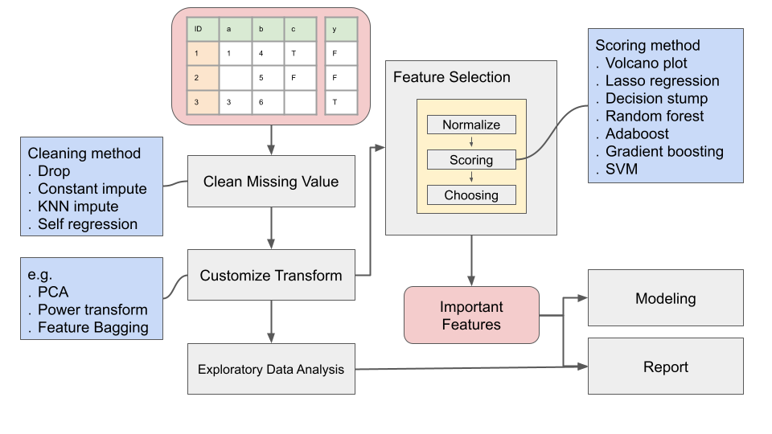
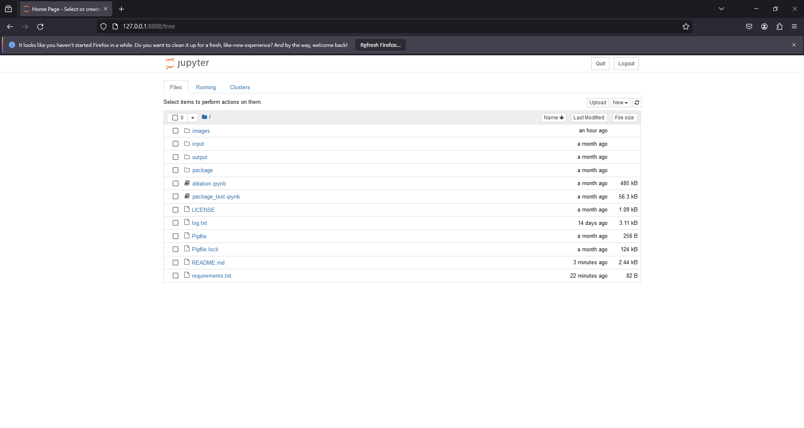
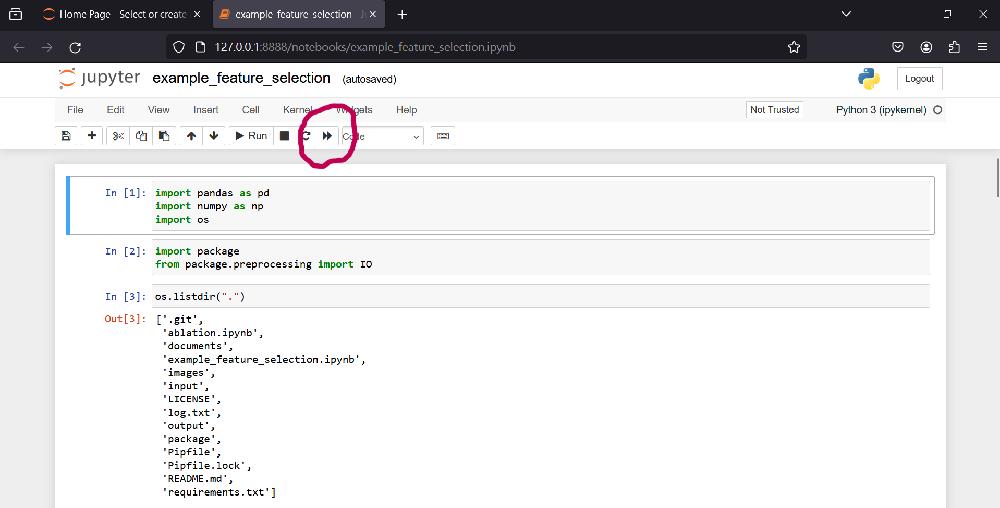

# Overview
(麻煩用中文寫三百字引言,介紹軟體目的)
This package aims to help analysis biomedical data using ML method in python.

 

# System Requirements
   1. Python 3.9+
   2. The following dependencies are required: numpy, pandas, scikit-learn, matplotlib, seaborn, tqdm, jupyter, lightgbm, xgboost

# Installation

### 1. Install Python
Please skip this step, if you have python 3.9+ installed in your PC.
Please follow the tutorial to install python:
        
    https://learn.microsoft.com/en-us/windows/python/beginners 

    
The "Visual Studio Code" and "Git" are optional.
### 2. Install Dependencies and Execute the Program
    Step 1. Download our scripts from Release (https://github.com/ICMOL/undetermined/releases).

    Step 2. Install dependencies
    Please open Windows PowerShell, move to the directory of our scripts, and execute the following command.
    > pip install -r ./requirements.txt          

    Step 3. Open ipytho
    Please execute the following command to open the interface of python (ipython).
        > jupyter notebook    

    
    If the browser shows jupyter's main page, the dependency is satisfied.

# Usage example    
The fowlling operation sould be done in jupyter notebook interface within your browser (as 3.iv).    

Chosse one of the following examples, double click it in jupyter interface:    
- example_feature_selection.ipynb

click the buttom and the script should start.

# [Documents](./documents/main.md)
For further details.
