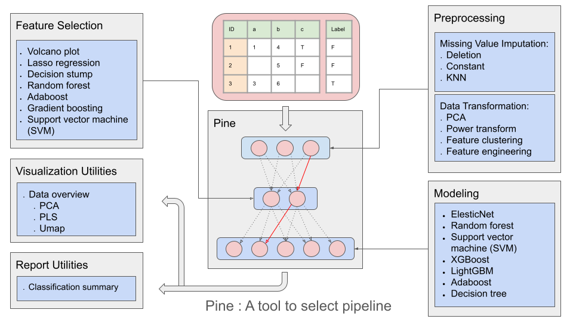
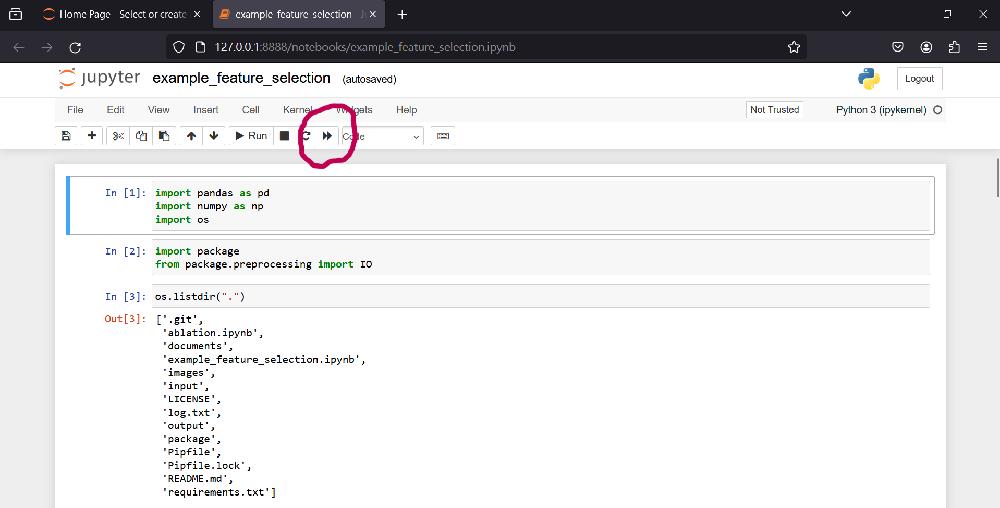

# Overview
This package aims to help analysising biomedical data using ML method in python.    

 

# System requirements
Python 3.10+

# Installation
PineBioML is available on PyPI. You can access it through:
> pip install PineBioML

For those who do not know how to use python, you can follow our step by step Installation tutorials.
 - [Windows11/10](./documents/Installization/win11/win11.md)
 - MacOs

# Examples
After installation, you can download examples from release.

> https://github.com/user-attachments/files/17568138/examples.zip

Chosse one of the following examples, double click it in jupyter interface:    
| ID |     Name      |       Description                |
|----|---------------|----------------------------------|
|  1 | example_BasicUsage multi class.ipynb   | Demonstrate the basic features of PineBioML on a multi-class classification task.  |  |
|  2 | example_BasicUsage regression.ipynb   | Demonstrate the basic features of PineBioML on a regression classification task.  |  |
|  3 | example_Proteomics.ipynb         | An example on proteomics data analysis |  |
|  4 | example_PipeLine.ipynb           | Demonstrate how to use the pipeline to store the whole data processing flow |  |
|  5 | example_Pine.ipynb               | Demonstrate how to use Pine ml to finding the best data processing flow in an efficient way |  |

### Execute the scripts
Click the buttom and the script should start.

# Features

### 0. Document

[API](https://htmlpreview.github.io/?https://github.com/ICMOL/PineBioML/blob/main/documents/API/index.html)

### 1. Missing value preprocess
|        ID         |        Option         |  Definition |
|---------------------|----------------|------------------------------|
|  1 | Deletion              | Remove the features that are too empty.     |
|  2 | Imputation with a constant value  | Impute missing values with a constant value, such as 0 or the feature mean. |
|  3 | Imputation using K-NN algorithm        | Impute missing values with the mean or median of the k nearest samples. |

### 2. Data transformation
|        ID         |        Option         |  Definition |
|---------------------|----------------|------------------------------|
|  1 | PCA              | Principal component transform.    |  |
|  2 | Power transform  | To make data more Gaussian-like, you can use either Box-Cox transform or Yeo-Johnson transform. |   |
|  3 | Feature clustering        | Group similar features into a cluster.  |  |
|  4 | Feature expansion        | Generating new features by add/product/ratio in random pair of existing features.  |  |

### 3. Feature selection
|        ID         |        Option         |  Definition |
|---------------------|----------------|------------------------------|
|  1 | Volcano plot     | Selecting by group p-value and fold change   |  |
|  2 | Lasso regression | Selecting by Linear models with L1 penalty |   |
|  3 | Decision stump   | Selecting by 1-layer decision tree  |  |
|  4 | Random Forest    | Selecting by Gini impurity or permutation importance over a Random Forest |  |
|  5 | AdaBoost         | Selecting by Gini impurity over a AdaBoost model  |  |
|  6 | Gradient boosting| Selecting by Gini impurity over a gradient boosting, such as XGboost or LightGBM  |  |
|  7 | Linear SVM              | Selecting by support vector from support vector machine |  |

### 4. Model building
|        ID         |        Option         |  Definition |
|---------------------|----------------|------------------------------|
|  1 | ElasticNet    | Using Optuna to find a not-bad hyper parameters on given dataset.   |  |
|  2 | SVM       | Using Optuna to find a not-bad hyper parameters on given dataset. |   |
|  3 | Decision Tree | Using Optuna to find a not-bad hyper parameters on given dataset.  |  |
|  4 | Random Forest | Using Optuna to find a not-bad hyper parameters on given dataset.  |  |
|  5 | AdaBoost | Using Optuna to find a not-bad hyper parameters on given dataset.  |  |
|  6 | XGBoost | Using Optuna to find a not-bad hyper parameters on given dataset.  |  |
|  7 | LightGBM | Using Optuna to find a not-bad hyper parameters on given dataset.  |  |
|  8 | CatBoost | Using Optuna to find a not-bad hyper parameters on given dataset.  |  |

### 5. Report and visualization
|        ID         |        Option         |  Definition |
|---------------------|----------------|------------------------------|
|  1 | data_overview  | Giving a glance to input data.   |  |
|  2 | classification_summary | Summarizing a classification task |  |

# Contact us
> 112826006@cc.ncu.edu.tw

# Cites
The example data is from [LinkedOmicsKB](https://kb.linkedomics.org/)
>  **A proteogenomics data-driven knowledge base of human cancer**, Yuxing Liao, Sara R. Savage, Yongchao Dou, Zhiao Shi, Xinpei Yi, Wen Jiang, Jonathan T. Lei, Bing Zhang, Cell Systems, 2023.
