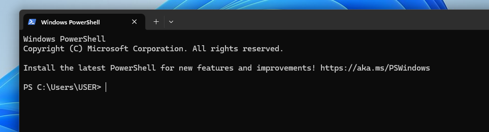
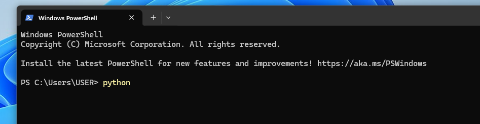

# AutoBioML
### Overview
(麻煩用中文寫三百字引言,介紹軟體目的)
This package aims to help analysis biomedical data using ML method in python.

 

# Index
- Installation
- Usage example
- [Documents](./documents/main.md)

# Installation
0. ### Requirement
    1. Windows10 or 11
    2. Python >= 3.9
    3. dependency in requirements.txt    

1. ### Python Installation
    If you already have python >= 3.9 installed in your PC, then skip to next step *Powershell and Python*.   

    Please follow microsoft's tutorial to install python:    
    https://learn.microsoft.com/en-us/windows/python/beginners    
    You only need to finish the first part *Install Python* in the turorial, wheather to use visual studio code is optional. In this project, we use ipython notebook mainly. 

2. ### Powershell and Python
    1. Open the Start menu, searching for Windows PowerShell.    
        
    2. It will open a terminal like this:
            
    3. Type in python.    
            
    4. You should see the version information of python that you just installed. 
        
    5. In final to exit python terminal, type in exit()
        

3. ### Update modules and dependency
    1. Download release.

    2. Open Powershell (as step 2.ii), and move to the direction to the repository by entering:
        > cd direction\\to\\repository\

    3. Update pip and install dependency:
        > pip install --upgrade pip    
        > pip install -r ./requirements.txt    

    4. Open ipython interface by entering:    
        > jupyter notebook    

        This should open the browser and showing the repostory folder.    

    
    If the browser shows jupyter's main page, the dependency is satisfied.

# Usage example    
The fowlling operation sould be done in jupyter notebook interface within your browser (as 3.iv).    

Chosse one of the following examples, double click it in jupyter interface:    
- example_feature_selection.ipynb

click the buttom and the script should start.

# [Documents](./documents/main.md)
For further details.
