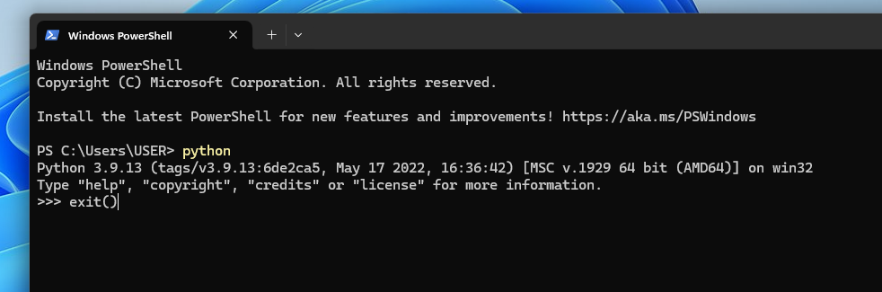

# _______ auto Bio-Feature Selection
This package aims to help you analysis bio data in tabular format using ML method in python.    
In the First stage, we will provide feature selection and autoML.

# Index
1. Installation
2. Usage example
3. Method

# Installation
0. ### Requirement
    Windows10 or 11

1. ### Environment Setting
    If you already have python >= 3.9 installed in your PC, then skip to next step.   

    a. Please follow microsoft's tutorial to install python:    
    https://learn.microsoft.com/en-us/windows/python/beginners    
    You only need to follow the first step "Install Python" in the turorial, wheather to use visual studio code is optional. In this project, we use ipython notebook mainly.

    b. Check if your installation of python succeed.    
    Open the Start menu, type Windows PowerShell, select Windows PowerShell.    
        

    It will open a window like this:
        

    Type in python    
        
    
    and then press Enter.
    
    You should see the version information of python that you just installed. 

    In final to exit python terminal, type in exit()
    

    
    

2. ### Update modules and install dependency
    a. Download release.

    b. Open Powershell (as step 1.b), and move to the direction to the repository by entering:
    > cd direction\\to\\repository\

    c. Update pip and install dependency:
    > pip install --upgrade pip    
    > pip install -r ./requirements.txt    

    d. Open ipython interface by entering:    
    > jupyter notebook    

    This should open the browser and showing the repostory folder.    
    If the browser is opened, then the dependency is required.
    

# Usage example
    The fowlling operation sould be done in jupyter notebook interface within your browser (as 2.).    

    a. Click and open the ipython notebook package_test.ipynb    
    b. Find the button "Run all" and click it    

# Method
### Overview
    

1. Input
2. Preprocessing
3. Feature selection
4. EDA
5. auto-ML
6. Report

