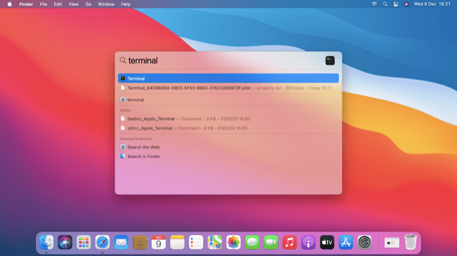
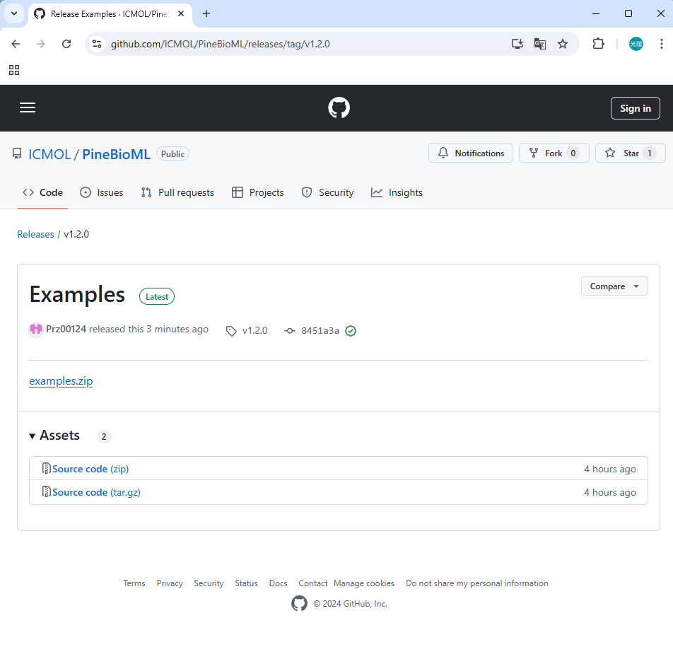

### Step 1. Install Python
Skip this step if you already have python 3.9+ installed in your PC.    

Downloading python 3.11 from [here](https://www.python.org/downloads/release/python-3119/). Look for the 'macOS 64-bit universal2 installer', which is the version for Mac.

Cliking on continue button and the installation of python will be done.

### Step 2. Install PineBioML
Open Terminal.

Enter this command to check whether Python installed correctly:
> python3 --version

We expect that returns:
> Python 3.11.9

Enter this command to prepare to install PineBioML: 
> pip3 install --upgrade pip 

Enter this command to install PineBioML, it will take about 10 minutes. You can jump to Step 3 while the installation is in progress: 
> pip3 install PineBioML jupyterlab

### Step 3. Download PineBioML examples
Download the examples.zip from [here](https://github.com/ICMOL/PineBioML/releases/download/example/examples126.zip) and unzip.

    
### Step 4. Open the interface for examples
After the installation of PineBioML finished, open a new Terminal. Copy the path to example folder.

Enter cd and paste the path that you just copied as (for instance):
> cd __ThePathToExample__

Enter the command to call for jupyter which is an interactive python interface.
> python3 -m notebook
If it doesn't work for you, then try:
> jupyter notebook

### Step 5. Execute an example
You can open an example by clicking on it and run it by the ">>" button.

### Note
- Each time you want to run an example or a modified version, you have to repeat Step 4. and Step 5. .

- Further information please refer to our tutorial or contact us by:
> 112826006@cc.ncu.edu.tw
