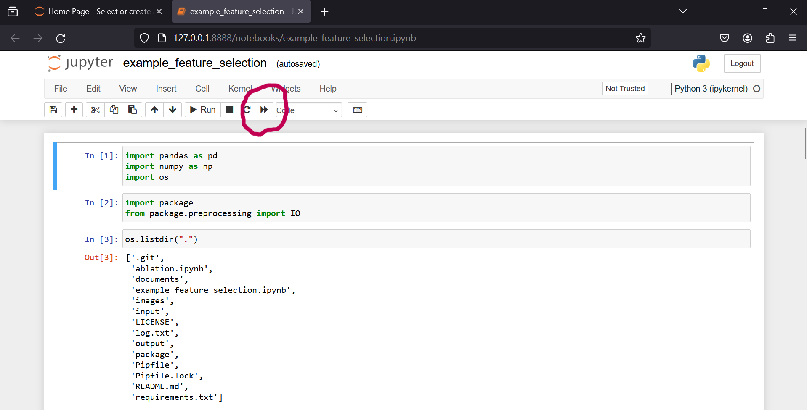

### Step 1. Install Python
Skip this step if you already have python 3.9+ installed in your PC.    

Open Microsoft Store.

 Search for Python and choose a Python version >=3.9 . I recommand to use python 3.11 .

Click on "Get".

Then Python will be installed on your PC.    

### Step 2. Install PineBioML
Open powershell.

It's how powershell looks like. Some versions are blue and that is ok.

Enter this command to check whether Python installed correctly:
> pip list

Enter this command to prepare to install PineBioML: 
> python -m pip install --upgrade pip 

Enter this command to install PineBioML, it will take about 10 minutes. You can jump to Step 3 while the installation is in progress: 
> pip install PineBioML jupyterlab

### Step 3. Download PineBioML examples
Download the examples.zip from [here](https://github.com/ICMOL/PineBioML/releases/download/example/examples126.zip) and unzip.

    
### Step 4. Open the interface for examples
After the installation of PineBioML finished, open a new powershell terminal

Copy the path to example folder.

Enter cd and paste the path that you just copied as (for instance):
> cd __ThePathToExample__

Enter the command to call for jupyter which is an interactive python interface.
> python -m notebook

### Step 5. Execute an example
You can open an example by clicking on it and run it by the ">>" button.

### Note
- Each time you want to run an example or a modified version, you have to repeat Step 4. and Step 5. .

- Further information please refer to our tutorial or contact us by:
> 112826006@cc.ncu.edu.tw
